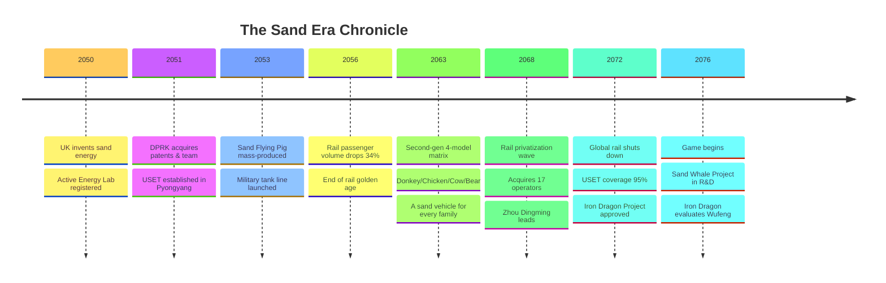
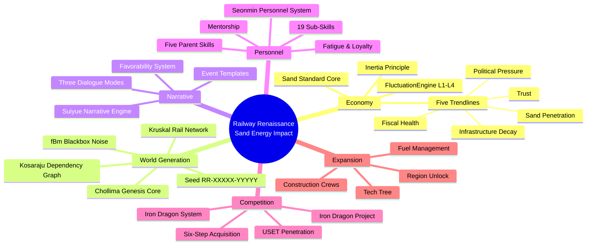
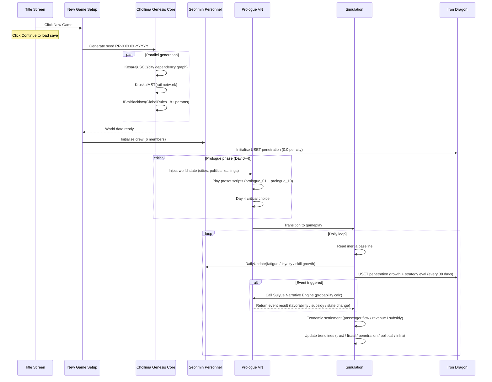
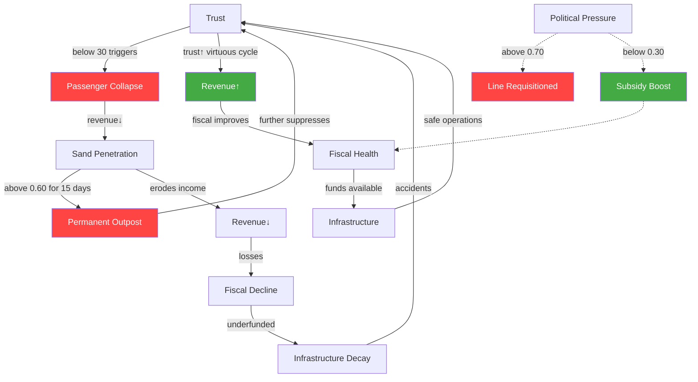
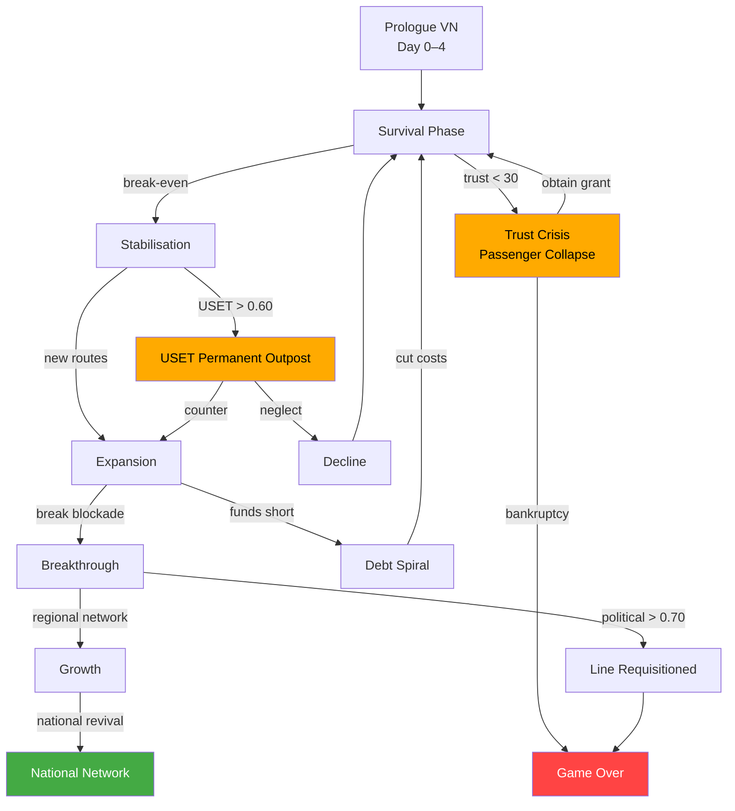
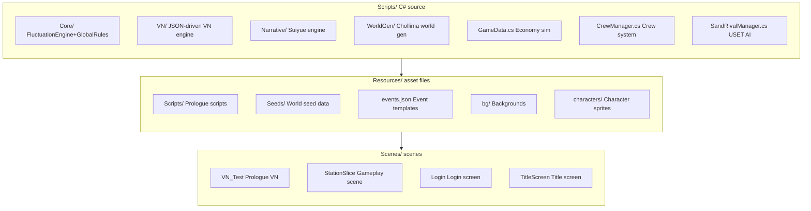
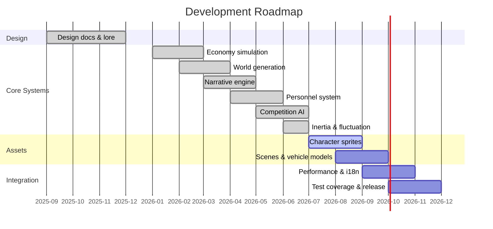
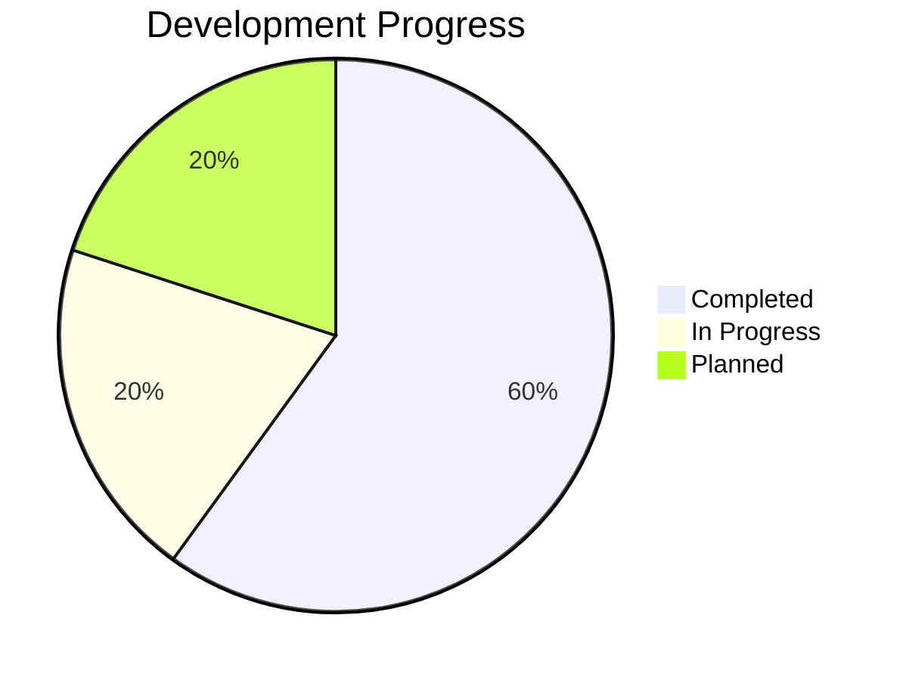

<div align="center">

# Railway Renaissance: Sand Energy Impact

[](https://unity.com)
[](https://dotnet.microsoft.com)
[](https://github.com/NMDX0721/RailwayRenaissance)
[](LICENSE)

<div align="center">

</div>

**Rails remember. Every train that runs is a defiance of forgetting.**

English | [简体中文](README.zh-CN.md)

</div>

---

**A railway revival simulation with visual-novel storytelling — a data-driven economy, a living rail network, and a world that responds to player choices. Every system is documented for AI-native modding: fork, point your agent at the docs, and build what you want.**

---

<div align="center">

</div>

<div align="center">
<i>The Origin of Every Miracle — Laboratory of Intelligent Dispatch Systems, Kim Il Sung University, April 18, 2076.</i>
</div>

The year the world gave up on railways, and the day something impossible quietly began.

Three days later, a researcher would leave this room to revive a railway on the brink of decommissioning in a mist-wrapped mountain village called Wufeng — 2,500 kilometres and one impossible bet away.

**Every story needs a place where it begins. This must be it.**

---

## The World

It is 2076. Twenty-six years ago, sand energy was a British laboratory experiment. Today, it is the foundation of a new world order.

In 2050, a British engineering team invented the sand-energy principle. The following year, the Democratic People's Republic of Korea — holder of the world's largest sand reserves — acquired the entire patent portfolio and established **United Sand Energy Technology (USET)** in Pyongyang. By 2053, the first commercial sand-energy vehicle, the "Sand Flying Pig," was in mass production. By 2056, rail passenger volume had fallen 34%. By 2068, ninety-one nations had dissolved their state railway systems. In 2072, the global rail network effectively shut down.

The DPRK, once isolated, became the world's sole superpower — not through military conquest, but through control of the resource that powers everything: sand.

USET is not merely a company. It is a joint venture structured for plausible deniability: a Luxembourg holding platform (51% nominally registered) and the **Baekdu Mountain Power Corporation** (49%, the DPRK state entity) hold the shares. Actual control flows through three undisclosed agreements — management, technology licensing, and exclusive sand supply. On paper, it is a normal multinational. In reality, it is a state instrument.

Sand vehicles have six critical weaknesses: limited heavy-freight capacity, vulnerability to storms, short operational range, poor nighttime efficiency, dependence on sand supply, and air-traffic restrictions. The railway's six strengths mirror each of these — a design intentionality that the player can exploit.

The player inherits a decommissioned line in Wufeng, a mist-wrapped tea village in central China, and must prove that the iron road still has a place in a world that has moved on.

**Sand energy timeline:**



> [!IMPORTANT]
> Sand vehicles have six critical weaknesses: limited heavy-freight capacity, vulnerability to storms, short operational range, poor nighttime efficiency, dependence on sand supply, and air-traffic restrictions. The railway's six strengths mirror each of these — a design intentionality that the player can exploit.

---

## Game Structure

### The Five Trendlines

Beneath the surface of every playthrough, five interlinked trendlines operate. Invisible until they cross a threshold, each can trigger irreversible change:

| Trendline | Definition | What happens when it crosses |
|-----------|------------|------------------------------|
| **Trust** | Public confidence in the railway | Below 30: passenger volume collapses into a snowball decline |
| **Fiscal Health** | The player's financial standing | Sustained loss: credit rating downgraded, interest rates rise |
| **Sand Penetration** | USET's market share in each town | Above 0.60 for 15 days: USET establishes a permanent outpost |
| **Political Pressure** | Degree of government oversight | Above 0.70: line may be requisitioned or forcibly transferred |
| **Infrastructure Decay** | Cumulative wear on the line | Below 40: state ceiling permanently reduced by 10% |

The trendlines are not independent. A trust collapse feeds sand penetration, which reduces revenue, which worsens fiscal health, which accelerates infrastructure decay — a cascade that can end a playthrough if left unchecked. Conversely, early investment in trust creates a virtuous cycle that compounds over time.

### Tech Tree

Four research directions form an open network — not a linear tree. Each node unlocks when its prerequisites are met:

| Field | What it unlocks |
|-------|----------------|
| **Infrastructure** | Track upgrades, station expansions, bridge repairs |
| **Locomotive** | New locomotives, fuel efficiency, cargo capacity |
| **Dispatch** | Scheduling algorithms, crew optimization, passenger analytics |
| **Social** | Community relations, political leverage, heritage funding |

Research is not about filling a progress bar. It is about choosing which problem to solve next — and living with the problems you choose not to solve.

### Region Unlock & Political System

The world is divided into six regions, each with multiple cities. Unlocking a region requires meeting a trust threshold, paying a connection cost, and completing a story event. Each region has a dominant political tendency — authoritarian, market, or welfare — that determines how the local government evaluates the player's performance.

Political tendency shifts over time based on player actions. An authoritarian region rewards stability and punishes disruption. A market region rewards profit and punishes inefficiency. A welfare region rewards service and punishes neglect. The player must adapt their strategy to each region's political climate, or face reduced subsidies, harsher inspections, and eventual requisition.

### Core Systems

The game runs on five connected simulation engines, each with its own specification and formula set:

- **Sand Standard Core** — the economic foundation, driving passenger flow, fares, subsidies, and the interlock of five trendlines. Named after the sand-standard monetary system — sand energy as the global hard currency anchoring all economic activity.
- **Chollima Genesis Core** — generates a unique world structure and all gameplay parameters from a seed code at the start of each playthrough. Named after the Chollima myth — the heavenly horse that gallops a thousand li, each playthrough a new race.
- **Suiyue Narrative Engine** — dynamically generates events based on world state and drives visual-novel dialogue. Named after the Chinese word "suiyue" (岁月) — narrative grows through time's sediment, not from a scripted tree.
- **Seonmin Personnel System** — manages crew skill trees, fatigue, loyalty, and growth curves. Named after the Korean "seonmin" (先民) — the first pioneers, the earliest builders of the railway revival.
- **Iron Dragon Competition System** — simulates USET's penetration expansion and strategy selection. Named after the Han dynasty celestial metaphor: the dragon and the heavenly horse are mirror images — the horse rules the sky, the dragon rules the land.

Detailed formulas and design documents for each engine are listed below:

**System architecture mindmap:**



**New game startup flow:**



<details>
<summary>Sand Standard Core — the economic engine</summary>

**Core formulas:**
```
PassengerFlow(t) = BaseFlow × sigmoid(Trust(t)) × SeasonalFFT(t) × L2Fluctuation(t)
TicketRevenue(t) = ∫(Flow(τ) × DynamicPricing(τ) × (1 + ElasticityCorrection(τ))) dτ
Subsidy(t) = OperationalScore(t) × PoliticalStanding(t) × StrategicValue(t) × InertiaDecay(t)
```

Each trendline has its own differential equation: when trust drops below threshold, `d(Flow)/dt ∝ -TrustDeficit × 0.005`; sand penetration above 0.60 for 15 days triggers a permanent outpost. All coefficients are generated per playthrough via GlobalRules, ensuring no two economies behave identically.

**Five trendline interlock:**



The reverse cascade creates a virtuous cycle. The economy is loss-making by design in the early game. The Chinese character for "rail" (铁) is composed of "gold" (金) on the left and "loss" (失) on the right — a silent admission that railways are seldom profitable. Survival depends on story-driven grants — subsidies from the government, community fundraising, and heritage preservation funds — each tied to a political relationship that must be maintained. The subsidy amount is calculated from operational evaluation, political standing, and the strategic value of the line, all modulated by the inertia principle.
</details>

<details>
<summary>Chollima Genesis Core — world generation</summary>

**Seed structure:** `RR-XXXXX-YYYYY`
- `RR`: Fixed prefix
- `XXXXX`: Hash encoding of city templates, dependency graph, resource distribution, political leanings
- `YYYYY`: Hash encoding of 18+ GlobalRules baseline parameters

**Generation pipeline:**
```
Seed → CityTemplateSampling → KosarajuSCC(DependencyGraph) → KruskalMST(RailNetwork) → ResourceDistribution → PoliticalAssignment → fBmBlackbox(GlobalRules)
```

**Blackbox function (fBm 3D Simplex noise):**
```
WorldState = ∑_{i=0}^{octaves} noise.snoise(float3(seed.x × lacunarity^i, k, seed.y)) × gain^i
GlobalRules[k] = Lerp(MinBound[k], MaxBound[k], WorldState)
```
- Octaves: 6, Lacunarity: 2.0, Gain: 0.5
- The same seed always produces the same world; a different seed produces a structurally different one.

**Outputs:** CityTemplates[], DependencyGraph(V, E), RailEdges[], ResourceMap, PoliticalMapping, GlobalRules{18+ params}, EventWeightTable
</details>

<details>
<summary>Suiyue Narrative Engine — event generation</summary>

**Event trigger probability:**
```
P(event) = BaseP × (1 - exp(-t / τ_cooldown)) × max(0, 1 - N_recent / N_max) × WorldStateWeight
```
- `τ_cooldown`: Cooldown half-life per event type
- `N_max`: Density cap (prevents narrative fatigue)

**Character favorability:**
```
Favorability(t+1) = Favorability(t) + EventValue × PersonalityWeight × InertiaDecay(t)
```
Accumulated favorability unlocks new story branches or special dialogue options.

The engine is templated: each event type has a slot structure, and the **WorldAnalyzer** fills slots based on runtime conditions. Events have cooldowns, density caps, and a logarithmic decay curve to prevent narrative fatigue.

**Three dialogue modes:**
- **Preset** — fully authored, fixed dialogue tree
- **Free AI** — player types anything, the AI responds in character
- **Hybrid** — preset branches with AI fallback for unanticipated topics
</details>

<details>
<summary>Seonmin Personnel System — crew management</summary>

**Skill growth:**
```
DailyGain = BaseGrowthRate × RoleMatch[skill] × (1 + max(0, ParentLevel - SubSkillLevel) / ParentLevel × 0.5) × FluctuationEngine.Weighted(base, variance) × EventModifier
```
- RoleMatch: core×1.0 / related×0.6 / low-cross×0.3 / high-cross×0.1
- Catch-up bonus: parent skill > sub-skill → exponential decay bonus

**Fatigue & Loyalty:**
```
Fatigue(t+1) = clamp(Fatigue(t) + BaseFatigue + ConsecutiveWorkBonus + RoleBonus, 0, 100)
Loyalty(t) = Baseline + Σ(EventEffects) + SocialComparison(ColleagueSalary, SelfSalary) - WageDissatisfaction
SocialComparison: ΔLoyalty = -α × max(0, ColleagueSalary / SelfSalary - Threshold) × (1 - HiddenPatience/100)
```

**Mentorship:** Mentor ≥ Lv4 → Apprentice ×2 growth rate, Mentor gains 10% of apprentice's Δexp.
**Parent skill:** `ParentLevel = Σ(SubSkillLevel[i] × Weight[i]) / Σ(Weight[i])`, numeric 0-100.
</details>

<details>
<summary>Iron Dragon Competition System — the rival AI system</summary>

**Penetration dynamics:**
```
d(Penetration)/dt = α_natural + Σ(Campaign_i(t)) - Countermeasure(t)
α_natural = 0.0015/day
Campaigns: Advertising +0.005, FreeRides +0.003, PriceWar +0.008
```
Permanent outpost: Penetration > 0.60 for 15 consecutive days

**USET strategy selection (every 30 days):**
```
Strategy(t) = argmax_{s ∈ Strategies} E[Value(s) | WorldState(t)]
```

Named after the Han dynasty celestial metaphor: the heavenly horse (Chollima) and the dragon are mirror images — the horse rules the sky, the dragon rules the land. USET's public face is the "International Railway Heritage Foundation," a non-profit front that approaches struggling lines with offers of "heritage preservation." The six-step acquisition process is documented in the world lore.
</details>

### The Inertia Principle

> [!CAUTION]
> You are not making choices. You are carrying the consequences of past choices.

Every system has inertia — a historical baseline that drags against or accelerates the effect of player actions. The formula is unified across all systems:

```
Effect = ActionValue × (1 − InertiaCoefficient) + HistoricalBaseline × InertiaCoefficient
```

| System | Coefficient | What it means |
|--------|-------------|---------------|
| Passenger flow | 0.15 | A fare cut takes ~20 days to fully materialise |
| Employee loyalty | 0.15 | Past low wages linger; trust must be rebuilt |
| Sand penetration | 0.20 | USET's foothold is the hardest to reverse |
| Vehicle condition | 0.10 | A single overhaul cannot undo months of neglect |
| Political relations | 0.18 | A broken relationship takes weeks to repair |

The historical baseline is a 30-day weighted average: recent days matter more. When a system stays below a threshold for too long, it generates a **permanent legacy**: a tracked accident record, a USET outpost, a reduced vehicle-state ceiling, a political support downgrade. These legacies cannot be undone by simply raising the number — they require sustained improvement measured in months, not days.

A FluctuationEngine (L1 Simple / L2 Weighted / L3 Compound / L4 Blackbox) provides continuous, non-repeating variation using 3D Simplex noise (`noise.snoise`), ensuring that even when the underlying numbers are similar, the daily gameplay experience differs.

### RDA — Ri Dispatch Algorithm & Railway Decision Assistant

The player's grandfather developed the **Ri Dispatch Algorithm (RDA)**, a dynamic scheduling protocol that optimises train paths based on real-time passenger data. The player inherits both the algorithm and a phone-based assistant that runs a modified version of it — the **Railway Decision Assistant (RDA)**, sharing the same abbreviation.

The RDA system unlocks progressively as the player expands their network. Initially it provides basic scheduling suggestions. Later it enables predictive maintenance alerts, automated crew rostering, and dynamic fare adjustments based on demand forecasts. The phone assistant connects to the Kim Il Sung University server via the player's API key, drawing on the original scheduling algorithm left by the grandfather in the laboratory.

### Construction Crew & Fuel Management

Expanding the network requires more than buying new trains. The player must dispatch **construction crews** to lay new track, repair damaged sections, and upgrade stations. Each crew has its own skill progression and equipment requirements.

Fuel is the single largest ongoing expense. The NF-5<sub>Gengniu</sub> locomotive consumes 58.5 L/100 km at an average of 40-60 km/h on the aging Wufeng line. **Fuel-saving strategies** — coasting, optimised scheduling, reduced idling, and eventual locomotive upgrades — directly affect the bottom line. The fuel price is not fixed; it fluctuates with global sand-energy markets, modulated by the seasonal index and random events.

## Crew

The initial crew consists of five people, with Wang Xiaodi joining shortly after:

| Member | Role | Top Skill |
|--------|------|-----------|
| Old Chen | Last stationmaster | Ops·Driver 5/7 |
| Zhang Gong | Retired mechanic | RS·Mechanic 5/7 |
| Li Ayi | Community volunteer | Station·Conductor 4/7 |
| Zhao Shifu | Retired engineer | Ops·Controller 4/7 |
| Xiao Fang | Volunteer | Station·Conductor 1/7 |
| Wang Xiaodi | Fresh graduate | Ops·Driver 1/7 |

Each crew member has a **skill tree** rather than a single linear level. The tree consists of two layers:

**Parent skills** — five systems (Operations, Rolling Stock, Track, Signalling, Station Services) that correspond to real railway industry divisions. Each parent skill level is computed as the weighted average of its constituent sub-skills.

**Sub-skills** — each parent system contains 3–4 sub-skills, 19 in total. The "Operations" system, for example, branches into Driver, Shunter, Station Master, and Controller. Each sub-skill has independent 0–7 grade names, drawn from real international railway classification systems:

<details>
<summary>Sub-skill grade naming (0–7) by country system</summary>

| Level | Ops·Driver (China) | Ops·Shunter (China) | Ops·Station Master (Japan) | Ops·Controller (UK) |
|-------|-------------------|--------------------|---------------------------|---------------------|
| 0 | Untrained | Untrained | Untrained | Untrained |
| 1 | Apprentice Driver | Shunter Trainee | Station Clerk | Trainee Controller |
| 2 | Assistant Driver | Coupler | Instructor | Service Controller |
| 3 | Driver | Brakeman | Chief | Senior Controller |
| 4 | Instructor Driver | Shunting Foreman | Deputy Station Master | Control Manager |
| 5 | Senior Instructor Driver | Shunting Instructor | Station Master | Operations Manager |
| 6 | Chief Instructor Driver | Shunting District Chief | Area Station Master | Route Operations Director |
| 7 | Master Driver | Chief Shunter | Regional Station Master | National Control Centre Director |

| Level | RS·Mechanic (Germany) | RS·Carriage Fitter (UK) | RS·Brake Fitter (France) | RS·Electrician (Japan) |
|-------|----------------------|------------------------|-------------------------|----------------------|
| 0 | Untrained | Untrained | Untrained | Untrained |
| 1 | Apprentice (Auszubildender) | Apprentice | Brake Trainee (Apprenti) | Electrical Trainee (電気見習) |
| 2 | Journeyman (Geselle) | Junior Technician | Brake Fitter (Agent de maintenance) | Electrician (電気工) |
| 3 | Master (Meister) | Technician | Brake Technician (Technicien de maintenance) | Chief Electrician (電気主任) |
| 4 | Operations Manager (Betriebsleiter) | Senior Technician | Senior Brake Tech (Technicien supérieur) | Electrical Engineer (電気技術員) |
| 5 | Senior Master (Obermeister) | Technician Engineer | Team Leader (Responsable d'équipe) | Electrical Manager (電気管理長) |
| 6 | Technician (Techniker) | Senior Engineer | Brake Engineer (Ingénieur maintenance) | Electrical Director (電気統括長) |
| 7 | Engineer (Ingenieur) | Master Technician | Technical Director (Directeur technique) | Electrical Head (電気本部長) |

| Level | Track·Lineman (Japan) | Track·Bridge & Tunnel (International) | Track·NDT Inspector (Germany) |
|-------|----------------------|--------------------------------------|------------------------------|
| 0 | Untrained | Untrained | Untrained |
| 1 | Track Trainee (保線見習) | B&T Trainee | NDT Assistant (Prüfhelfer) |
| 2 | Lineman (保線工) | B&T Worker | NDT Inspector (Prüfer) |
| 3 | Track Chief (保線主任) | B&T Technician | NDT Inspector MT (Zerstörungsfreier Prüfer MT) |
| 4 | District Chief (保線区長) | B&T Inspector | NDT Inspector UT (Zerstörungsfreier Prüfer UT) |
| 5 | Track Manager (保線管理長) | B&T Supervisor | NDT Supervisor (Prüfaufsicht) |
| 6 | Track Director (保線統括長) | B&T Manager | NDT Engineer (Prüfingenieur) |
| 7 | Track Head (保線本部長) | Chief Bridge Engineer | Expert (Sachverständiger) |

| Level | Signalling·Signaller (UK) | Signalling·Comms (France) | Signalling·ETCS (Europe) |
|-------|--------------------------|--------------------------|--------------------------|
| 0 | Untrained | Untrained | Untrained |
| 1 | Trainee Signaller | Comms Trainee (Stagiaire télécom) | ETCS Trainee |
| 2 | Signaller (Grade 2-3) | Comms Agent (Agent télécom) | ETCS Technician |
| 3 | Signaller (Grade 4-5) | Comms Technician (Technicien télécom) | ETCS Engineer |
| 4 | Signaller (Grade 6-7) | Senior Comms Tech (Technicien supérieur télécom) | ETCS Senior Engineer |
| 5 | Signalling Supervisor | Comms Manager (Responsable télécom) | ETCS System Manager |
| 6 | Signalling Manager | Comms Engineer (Ingénieur télécom) | ETCS Project Director |
| 7 | Signalling Engineering Manager | Comms Director (Directeur des télécommunications) | ETCS Programme Director |

| Level | Station·Conductor (International) | Station·Ticket Clerk (Japan) | Station·Freight Clerk (Germany) |
|-------|----------------------------------|-----------------------------|-------------------------------|
| 0 | Untrained | Untrained | Untrained |
| 1 | Trainee | Ticket Trainee (窓口見習) | Freight Trainee (Güterverkehrsauszubildender) |
| 2 | Conductor | Ticket Clerk (窓口係) | Freight Clerk (Güterverkehrsmitarbeiter) |
| 3 | Train Captain | Sales Chief (営業主任) | Freight Dispatcher (Güterverkehrsdisponent) |
| 4 | Chief Conductor | Passenger Chief (旅客主任) | Freight Master (Güterverkehrsmeister) |
| 5 | Conductor Captain | Station Manager (駅務管理長) | Freight Operations Manager (Betriebsleiter Güterverkehr) |
| 6 | Chief Steward | Passenger Manager (旅客管理長) | Freight Regional Manager (Bereichsleiter Güterverkehr) |
| 7 | Inspector General | Sales Director (営業本部長) | Freight Director (Direktor Güterverkehr) |

</details>

The parent-child relationship is bidirectional: sub-skill gains feed back into the parent skill at a fixed proportion, and when the parent skill level exceeds a sub-skill, the sub-skill receives a catch-up bonus — experience efficiency increases with the size of the gap. This mechanism causes experienced employees to learn new skills within the same system faster than new hires.

Cross-system learning has a variable threshold. Sub-skills within the same system transfer naturally — an employee with driving proficiency can learn shunting with minimal efficiency loss. Cross-system learning (e.g., a driver learning rolling-stock maintenance) requires formal training and operates at a significantly reduced efficiency coefficient.

---

## Progression



Each phase has defined operational targets and story milestones: survival through grants, stabilisation toward break-even, expansion into new routes, breakthrough against USET's blockade, growth into a regional network, and the final challenge of national railway revival.

The game is structured around an implicit three-layer time model: daily decisions, monthly evaluations, and yearly strategic shifts. Political cycles affect subsidies. Random events — storms, oil-price spikes, holiday crowds, USET campaigns — vary the pressure across seasons. Every decision carries inertia. The player is always carrying the past.

---

## Getting Started

> [!TIP]
> Requires [Unity 6000.5.0f1](https://unity.com) and Git. Press <kbd>Esc</kbd> to return to the title screen at any time.

```bash
git clone https://github.com/NMDX721/RailwayRenaissance.git
```

Open the folder in Unity Hub and run:

| Scene | Purpose |
|-------|---------|
| `Scenes/VN_Test.unity` | Prologue visual novel (Day 0–4) |
| `Scenes/StationSlice_V1.unity` | Station management gameplay |
| `Scenes/Login.unity` · `Scenes/TitleScreen.unity` | Entry screens |

---

## AI-Native Modding

This project is designed for generative AI to restructure and extend — not just for developers who know C#.

Traditional games rely on modding APIs: the developer provides interfaces and specs, and players must learn the entire modding framework before they can build anything. This project works differently — documentation, code, and data formats are unified into structured Markdown that AI agents can read and modify directly. Want to add a feature? Describe the requirement, and the agent understands the system structure, modifies the code, and verifies the result. No modding API to learn, no framework to adapt to.

Every design decision, every formula, and every system parameter is documented. The documentation is not an afterthought — it is a first-class deliverable, maintained alongside the code, formatted for machine consumption.

**What this means for you:**

- Want to adjust the economic balance? Open `参考资料/沙本位经济核.md` and tell an AI agent to change the elasticity coefficients. The agent will understand the formula, update the code, and verify the result.
- Want to add a new crew skill? Open `docs/compose/specs/先民人事系统.md` and describe what the skill should do. The agent will find the right insertion point, implement the logic, and update the tests.
- Want to create a custom world seed? The seed format (`RR-XXXXX-YYYYY`) is documented in the Chollima Genesis Core spec. Generate a new seed, and the game will produce a unique world.

> [!TIP]
> The project is open source (MIT), the documentation is exhaustive, and the AI tooling is ready. Fork the repo, point your agent at the docs, and build what you want.

---

## Documentation

Design specifications are stored in the repository alongside the code.

| Document | Contents |
|----------|----------|
| [Game Design Document](参考资料/游戏开发文档.md) | Master index of all design docs |
| [Sand Standard Economy](参考资料/沙本位经济核.md) | Currency system, break-even analysis, full formula set |
| [Core Loop & Trendlines](docs/compose/specs/核心玩法循环.md) | Three-layer time model, five trendlines |
| [Cross-System Formulas](docs/compose/specs/跨系统联动公式.md) | Interlinked formula set + Inertia Principle |
| [Tech Tree](docs/compose/specs/科技树设计.md) | Open research network |
| [Region Unlock & Political System](docs/compose/specs/区域解锁与政治系统设计.md) | Six regions, political tendencies |
| [VN AI Design](参考资料/视觉小说系统设计.md) | Three-mode dialogue, provider layer |
| [Suiyue Narrative Engine](docs/compose/specs/岁月叙事引擎.md) | Template-based AI roadmap |
| [World & Timeline](参考资料/世界观扩展设定.md) | USET, sand-standard, lore |
| [World & Vehicle Specs](参考资料/世界观与车辆设定.md) | Vehicle parameters, route specs |
| [Character Design](参考资料/角色设定.md) | Character backgrounds, relationships |
| [Skill System](docs/compose/specs/先民人事系统.md) | 8-level skill tree, 19 sub-skills, growth formulas |
| [Inertia Principle](docs/compose/specs/惯性原则设计.md) | Historical deposition, fluctuation engine |
| [Iron Dragon Competition](docs/compose/specs/铁龙竞争系统.md) | USET rival AI, penetration algorithm |
| [Mod System Design](docs/compose/specs/Mod系统设计.md) | Modding interface, custom rules |
| [Tutorial Design](docs/compose/specs/教程与新手引导设计.md) | Onboarding flow, tutorial system |
| [VN-Gameplay Bridge](docs/compose/specs/VN与模拟经营对接文档.md) | Narrative and gameplay integration |
| [Post-Prologue Story](docs/compose/specs/序章后续剧情设计.md) | Story arcs, narrative events |
| [Timeline](参考资料/故事线时间轴.md) | Complete timeline, historical events |
| [Project Progress](参考资料/项目进度总览.md) | Development status, roadmap |

---

## Project Layout



---

## Development Status


-brightgreen)






**Implemented:**
- [x] Prologue VN scripts · VN-to-gameplay bridge · unified save/load · term glossary
- [x] Economy simulation · five trendlines · inertia system (historical baseline + nonlinear thresholds)
- [x] Crew system · 8-level skill tree (5 systems × 19 sub-skills) · social comparison · mentorship · wage negotiation · synergy · stance linkage
- [x] USET rival AI · penetration algorithm · Iron Dragon Project · random events · FluctuationEngine (L1–L4 + fBm)
- [x] Tutorial · GlobalRules (seed-driven config)
- [ ] Asset generation (character sprites, scenes, vehicle models)
- [ ] Integration & polish (performance optimisation, localisation, test coverage)

---

## Contributing

A personal, non-commercial, educational project by a high-school student. Contributions of any kind — art, balance values, story, code — are welcome. The [design documents](参考资料/游戏开发文档.md) are the source of truth; open an issue or pull request to propose changes.

---

## License

[MIT](LICENSE) © 2026 NMDX0721 — free to use, copy, modify, and distribute with attribution. Provided without warranty.

---

*Inspired by [Maitetsu: Last Run!!](https://store.steampowered.com/app/1434480/Last_Run/) and [Stardew Valley](https://store.steampowered.com/app/413150/Stardew_Valley/).*