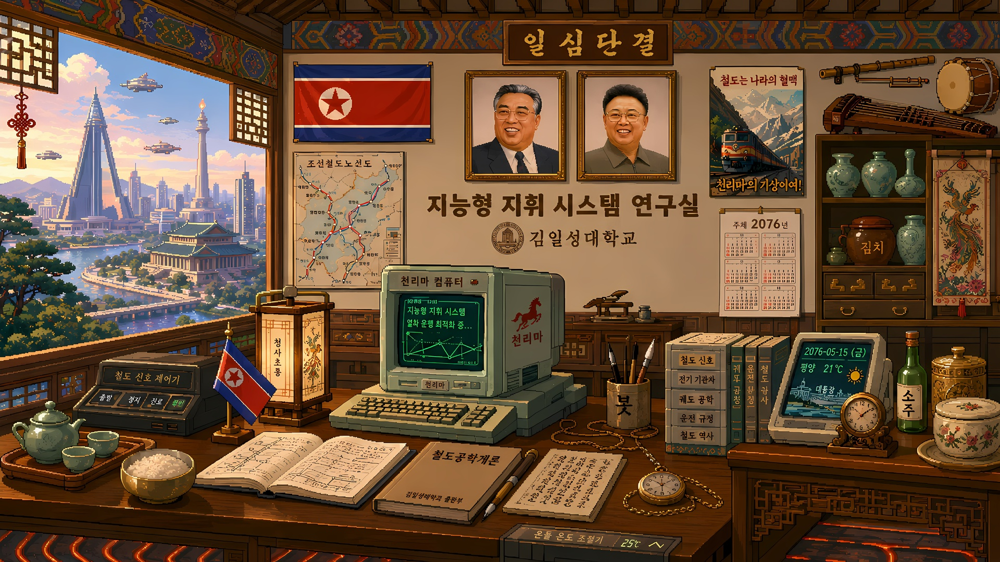

# 铁路复兴：沙能冲击 🚂

> *[English](README.md) | 简体中文*

一款硬核像素风铁路模拟经营 + 视觉小说游戏，使用 Unity 6 开发。

---

### 🖼️ 智能调度系统实验室



**金日成综合大学（平壤）—— 智能调度系统实验室**

金日成综合大学已连续二十三年位列**朝鲜大学综合评估指数（UEI）**首位，并在平壤共识学术排名中持续处于最高层级。其下属的智能调度系统实验室是国家重点实验室，隶属于国家科学院与铁道省双重管辖。

实验室的主要研究方向——利用实时客流数据进行动态路径优化——是该校自2060年代以来保持全球领先地位的学术领域。其计算基础设施包括一套专用仿真集群，该集群最初为朝鲜国家铁路调度网络开发，后在2072年铁路网调整后转为学术研究用途。

现任研究员林彪悍是荣誉研究生，其基于Dijkstra算法的变需求条件自适应调度研究成果已获国际运输经济研究所引用。实验室位于李升基纪念研究综合体东翼，南向窗户可俯瞰大同江。

在他的终端旁，放着一本翻旧的《铁路工程手册》。扉页上有一行褪色的字迹：

*"给彪悍——爷爷。"*

---

## 🎮 游戏介绍

### 故事背景

> 2076 年，沙能飞行器全面取代了铁路。你继承了爷爷在偏远村庄雾峰村的一条废弃铁路线。修复铁路，赢回社区信任，对抗沙能科技公司的步步蚕食。

### 世界观

2050 年沙能技术的发现重塑了全球秩序。英国的初期发明被朝鲜民主主义人民共和国收购并产业化——该国拥有全球最大的沙子储量。2053 年首款量产沙能载具"沙子飞猪号"的商业化标志着一个新时代的开始。到 2063 年，第二代载具已渗透到运输的每一个层级；到 2072 年，全球铁路网络已基本停止运营。

在这个世界中，朝鲜崛起为世界第一超级大国，其经济由沙能出口和军事应用驱动——包括"金正恩大沙子型"坦克。美国位居第二，中国第三。位于首都平壤的金日成综合大学已连续二十三年位列朝鲜大学综合评估指数（UEI）首位，并在平壤共识学术排名中持续处于最高层级。

### 玩法特色

- **硬核经济** — 前期纯运营必然亏损，剧情补贴是生存关键。每个决策都有重量。
- **慢节奏策略** — 世界在后台持续运行，玩家观察趋势、做长期策略选择、面对不可逆后果。
- **沙能竞争** — AI 驱动的竞争对手，主动发起广告战、价格战、收购你的线路。
- **人员管理** — 5 名独特角色，每人 4 项技能，疲劳系统、培训、岗位分配。
- **科技树** — 3 条互斥分支（工业 / 生态 / 自动化）。
- **政治周期** — 地方政府在威权、市场、福利三种倾向间周期性变化。
- **剧情驱动** — 序章为视觉小说，平滑过渡到经营玩法，剧情事件贯穿始终。
- **随机事件** — 10+ 事件模板：经济波动、天气、人事、沙能行动。

### 截图

*(开发中，截图待更新)*

---

## 🚀 快速开始

### 前置要求

- Unity 6000.4.6f1 (Unity 6)
- Git

### 安装

```bash
git clone https://github.com/NMDX721/RailwayRenaissance.git
```

在 Unity Hub 中打开：

1. 启动 Unity Hub → **添加** → **从磁盘添加项目**
2. 选择克隆的目录
3. 使用 Unity 6000.4.6f1 打开

### 场景

| 场景 | 说明 |
|------|------|
| `Scenes/Login.unity` | 登录界面 |
| `Scenes/TitleScreen.unity` | 标题界面（视频背景） |
| `Scenes/VN_Test.unity` | 视觉小说序章 |
| `Scenes/StationSlice_V1.unity` | 车站经营主场景 |

---

## 📁 项目结构

```
Assets/
├── Scripts/           # C# 源代码
│   ├── VN/            # 视觉小说系统
│   ├── GameData.cs    # 经济模拟
│   ├── CrewManager.cs # 人员管理
│   ├── EventManager.cs# 随机事件
│   ├── SandRivalManager.cs  # 沙能竞争 AI
│   └── ...
├── Resources/
│   ├── Scripts/       # VN 剧本 JSON (prologue_01~10)
│   ├── events.json    # 事件模板
│   └── characters/    # 角色立绘
├── Scenes/            # Unity 场景
└── Documentation/     # 设计文档
```

---

## 🛠 技术实现

### 技术栈

| 组件 | 技术 |
|------|------|
| 引擎 | Unity 6000.4.6f1 (Unity 6) |
| UI | UI Toolkit (VN/标题) + uGUI (登录) |
| VN 系统 | JSON 驱动，数据驱动对话 |
| 存档系统 | PlayerPrefs + JSON 序列化 |
| AI（未来） | 模板化（阶段1），llama.cpp（阶段2） |

### 设计文档

| 文档 | 说明 |
|------|------|
| [游戏开发文档](参考资料/游戏开发文档.md) | 主设计文档索引 |
| [经济系统](参考资料/经济系统.md) | 经济模型 v4.0 |
| [角色设定](参考资料/角色设定.md) | 角色档案与技能系统 |
| [世界观与车辆设定](参考资料/世界观与车辆设定.md) | 世界观设定与车辆参数 |
| [核心玩法循环](docs/compose/specs/核心玩法循环.md) | 玩法循环设计 |
| [跨系统联动公式](docs/compose/specs/跨系统联动公式.md) | 所有公式定义 |
| [科技树设计](docs/compose/specs/科技树设计.md) | 三分支科技树 |
| [沙能竞争系统设计](docs/compose/specs/沙能竞争系统设计.md) | 沙能 AI 行为 |

### 核心公式

- **日客流**：`人口 × 0.001 × (0.5 + 信任度 × 0.005) × (1 - 沙能渗透率) × (1 + 乘务员等级 × 0.03)`
- **日燃料费**：`58.5 × 92km / 100 × (1 + (100 - 车况) / 200) × 15 沙币/升`
- **事故概率**：`0.5% × 老化系数 × 司机技能系数 × 维护系数 × 天气系数`
- **信任变化**：`正常运营(+0.014/天) - 事故(0.08×严重度) - 沙能广告(0.03)`

---

## 📊 开发进度

```
Phase 1: 设计文档修复        ✅ 完成
Phase 2: 代码实现            ✅ 完成（11/11 任务）
Phase 3: 资产生成            ⏳ 待开始
Phase 4: 整合打磨            ⏳ 待开始
```

### Phase 2 任务清单

| 任务 | 状态 |
|------|------|
| 序章 JSON 剧本（场景 07-10） | ✅ |
| VN→经营过渡系统 | ✅ |
| 经济系统与公式实现 | ✅ |
| 人员管理系统 | ✅ |
| 随机事件系统（10 个事件） | ✅ |
| 沙能竞争 AI | ✅ |
| 教程引导系统 | ✅ |
| 统一存档系统 | ✅ |
| 术语高亮系统 | ✅ |

---

## 📄 许可协议

[MIT](LICENSE) © 2026 NMDX721

宽松的开源许可证：你可以自由使用、复制、修改、分发本软件，只需保留版权声明。不提供任何担保。

---

*参考《まいてつ》(Maitetsu) 和《星露谷物语》(Stardew Valley) 的灵感。*